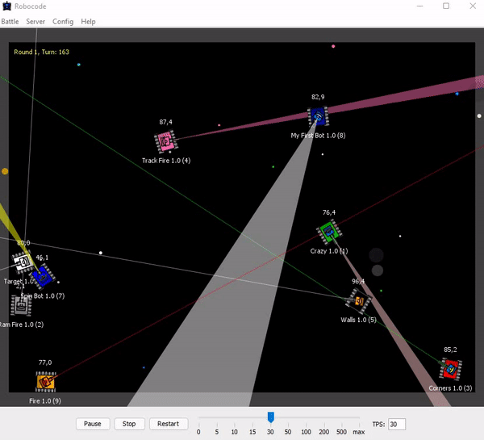

# Robocode Tank Royale - Robot Repository

Welcome to the repository for my robot designed for the Robocode Tank Royale game. This project features a virtual tank bot programmed to compete in Robocode's dynamic battle arena.

## About Robocode Tank Royale

Robocode is a programming game where you code a bot in the form of a virtual tank to compete against other bots in a virtual battle arena. The objective is to develop a bot with effective logic for movement, scanning, firing, and reacting to various battle events.

Robocode Tank Royale is an evolved version of the original Robocode, where bots compete over the Internet via web sockets. It aims to enhance programming and AI skills through engaging, real-time battles.

Learn more about Robocode Tank Royale [here](https://github.com/robocode-dev/tank-royale).

## Example of a battle (provided by Robocode community)

